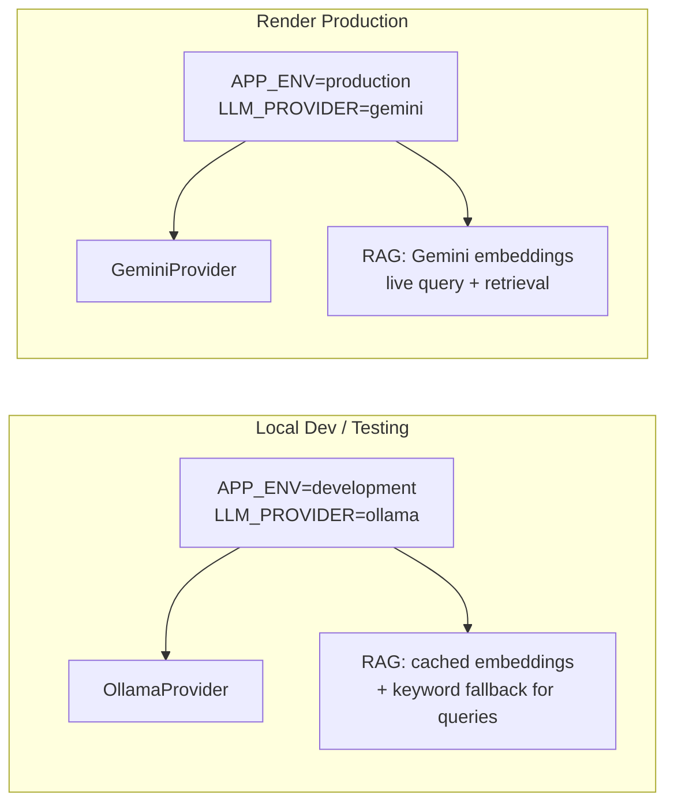
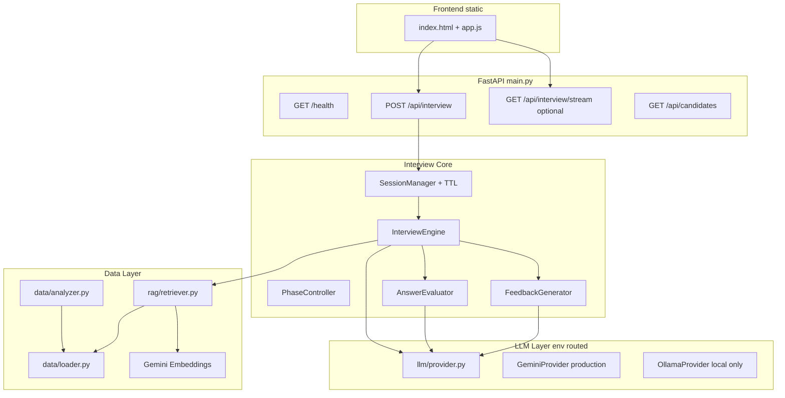
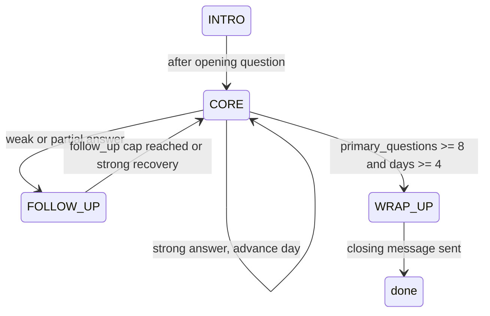

# AI Interview Agent — Full Improvement Implementation Plan

## Current Baseline

The project is feature-complete for the hackathon spec ([`technical-spec.md`](technical-spec.md)): FastAPI backend ([`main.py`](main.py)), interview engine ([`interview/engine.py`](interview/engine.py)), in-memory sessions ([`interview/session.py`](interview/session.py)), dual LLM fallback ([`llm/provider.py`](llm/provider.py)), and static chat UI ([`static/`](static/)). Gaps to address: no deployment artifacts, no RAG, loose interview state tracking, minimal feedback schema, no tests, no `.gitignore`, and exposed API key in [`.env.example`](.env.example).

## LLM & Environment Strategy

**User requirement:** Ollama is for **local testing only**; **Gemini API** is used in **production deployment** (Render). The current [`AutoLLMProvider`](llm/provider.py) auto-fallback chain (Gemini → Ollama → mock) will be replaced with explicit environment-based routing.



| Environment | `APP_ENV` | `LLM_PROVIDER` | Chat / Eval / Feedback | RAG |
|-------------|-----------|----------------|------------------------|-----|
| Local testing | `development` | `ollama` | Ollama (`OLLAMA_MODEL`) | Pre-built `embedding_cache.json` + keyword match for query (no Gemini key required) |
| Production (Render) | `production` | `gemini` | Gemini (`gemini-2.0-flash`) | Gemini `text-embedding-004` live |
| Unit tests | `test` | `mock` | `OfflineMockProvider` | Static fixture index, no API calls |

### Config changes ([`config.py`](config.py))

Add:
```python
APP_ENV = os.getenv("APP_ENV", "development")  # development | production | test
LLM_PROVIDER = os.getenv("LLM_PROVIDER", "ollama" if APP_ENV == "development" else "gemini")
```

- **Production:** fail fast at startup if `GEMINI_API_KEY` is missing (no silent Ollama/mock fallback)
- **Local:** skip Gemini health check; probe Ollama `/api/tags` instead
- **Remove** the Gemini→Ollama auto-fallback in production code paths

### `.env` files

**[`.env.example`](.env.example)** (local dev template):
```
APP_ENV=development
LLM_PROVIDER=ollama
OLLAMA_BASE_URL=http://localhost:11434
OLLAMA_MODEL=gemma4:latest
# GEMINI_API_KEY not required for local Ollama testing
```

**Render dashboard** (production only):
```
APP_ENV=production
LLM_PROVIDER=gemini
GEMINI_API_KEY=<secret>
GEMINI_MODEL_NAME=gemini-2.0-flash
# No OLLAMA_* vars set
```

## Target Architecture



---

## Phase 1 — Foundation & Security

**Goal:** Clean repo, safe secrets, typed data models, health checks.

### 1.1 Repository hygiene
- Add [`.gitignore`](.gitignore): `.env`, `__pycache__/`, `.venv/`, `*.pyc`, `.chroma/`, `*.db`
- Replace real key in [`.env.example`](.env.example) with placeholder `GEMINI_API_KEY=your_key_here`
- Remove hardcoded `sys.path.append(...)` from [`config.py`](config.py), [`models.py`](models.py), [`llm/provider.py`](llm/provider.py)

### 1.2 Typed candidate models
Extend [`models.py`](models.py) with Pydantic schemas matching [`candidates.json`](candidates.json):

```python
class MemberSchema(BaseModel): ...
class MissionSchema(BaseModel): ...
class SignalsSchema(BaseModel): ...
class CandidateSchema(BaseModel):
    member: MemberSchema
    missions: List[MissionSchema]
    signals: SignalsSchema
```

- Change `InterviewRequest.candidate` from `Dict[str, Any]` to `Optional[CandidateSchema]`
- Update [`main.py`](main.py) to pass validated candidate dict into session manager

### 1.3 LLM provider refactor ([`llm/provider.py`](llm/provider.py))
Replace `AutoLLMProvider` auto-fallback with environment-aware factory:

```python
def get_llm_provider() -> LLMProvider:
    if config.LLM_PROVIDER == "mock" or config.APP_ENV == "test":
        return OfflineMockProvider()
    if config.LLM_PROVIDER == "gemini":
        return GeminiProvider()  # production only; raises if no key
    if config.LLM_PROVIDER == "ollama":
        return OllamaProvider()  # local testing only
    raise ValueError(f"Unknown LLM_PROVIDER: {config.LLM_PROVIDER}")
```

- Remove Gemini→Ollama→mock cascade from production path
- Log clearly at startup: `"LLM: Ollama (local)"` vs `"LLM: Gemini (production)"`

### 1.4 Provider health at startup
- Add `startup` event in [`main.py`](main.py) calling new `llm/health.py`:
  - **Production:** probe Gemini; fail startup if unreachable or key missing
  - **Development:** probe Ollama `/api/tags`; warn if unavailable
  - **Test:** skip probes
- Add `GET /health` returning `{ "status": "ok", "env": "development|production", "llm": "gemini|ollama|mock" }`

### 1.5 Security hardening
- Restrict CORS via env `CORS_ORIGINS` (default `*` for local dev, set to Render URL in prod)
- Add simple in-memory rate limit on `/api/interview` (e.g. 30 req/min per IP via middleware or `slowapi`)

---

## Phase 2 — Interview Engine Overhaul

**Goal:** Deterministic flow, phases, answer evaluation, mission/signal-aware prompts.

### 2.1 Session state refactor
Update [`interview/session.py`](interview/session.py):

| New field | Purpose |
|-----------|---------|
| `phase: Literal["INTRO","CORE","FOLLOW_UP","WRAP_UP"]` | Explicit interview phases |
| `primary_questions_asked: int` | Count only new topic questions |
| `follow_ups_on_current_day: int` | Cap follow-ups per day (max 2) |
| `last_answer_quality: Optional[str]` | accurate / partial / incorrect / off_topic |
| `interview_notes: str` | Rolling summary for context compression |
| `created_at`, `last_active_at` | TTL cleanup |
| `current_day_question_asked: bool` | Prevent skipping day without asking |

Replace `questions_asked` increment logic: only increment `primary_questions_asked` when a **new** primary question is asked, not on rephrases or acknowledgments.

### 2.2 Phase controller (new file)
Create [`interview/phases.py`](interview/phases.py):



- `get_phase_instructions(phase, session) -> str` appended to system prompt
- Server **forces** transition to `WRAP_UP` when `primary_questions_asked >= 8` and `len(covered_days) >= 4` — no reliance on LLM token `[INTERVIEW_COMPLETE]`

### 2.3 Answer evaluator (new file)
Create [`interview/evaluator.py`](interview/evaluator.py):
- Lightweight LLM call with structured JSON output:
  ```json
  { "quality": "accurate|partial|incorrect|off_topic", "key_points": [], "gaps": [] }
  ```
- Called in `process_turn` **before** generating next question
- Drives phase transitions and follow-up vs advance decisions in [`interview/engine.py`](interview/engine.py)

### 2.4 Enhanced candidate analysis
Update [`data/analyzer.py`](data/analyzer.py):
- Use `signals.commitDays`, `signals.missionsFirstTry`, `signals.missionsCompleted` to compute a **engagement score** (0–1)
- Weight `target_days` ordering:
  - Low engagement → prioritize skipped/failed days
  - High engagement → prioritize deep dives on first-try wins + capstone module
- Expose formatted `mission_summary` string per topic for prompt injection:
  > "Prompt Engineering Fundamentals — passed after 4 attempts (struggle area)"

Update [`interview/prompts.py`](interview/prompts.py) to include `{mission_summary}`, `{engagement_score}`, and `{last_answer_evaluation}` placeholders.

### 2.5 Context window management
In [`interview/engine.py`](interview/engine.py):
- After every 4 turns, call LLM to update `session.interview_notes` (3–5 bullet summary)
- When building messages for LLM, send: system prompt + `interview_notes` + last 6 conversation turns (not full history)
- Keep full transcript in `session.messages` for feedback generation only

### 2.6 Deterministic day advancement
Replace `questions_asked % 2 == 0` logic in [`interview/engine.py`](interview/engine.py):

```python
# Advance day only when:
# - answer quality is accurate or partial (not off_topic/nonsense)
# - follow_ups_on_current_day == 0 OR quality == accurate
# - primary question for current day was answered substantively
session.advance_target_day()
session.reset_day_follow_ups()
```

---

## Phase 3 — Curriculum RAG

**Goal:** Gemini embeddings + in-memory cosine similarity (per your preference).

### 3.1 New module structure
```
rag/
  __init__.py
  indexer.py      # Build embedding index at startup
  retriever.py    # Query by day + semantic similarity
  embeddings.py   # Gemini embedding API wrapper
```

### 3.2 Index construction ([`rag/indexer.py`](rag/indexer.py))
At app startup, chunk each day from [`curriculum.json`](curriculum.json) into documents:

```
"Embeddings Explained | Tools: ... | Objectives: ..."
```

- **Production:** call Gemini `text-embedding-004` via [`rag/embeddings.py`](rag/embeddings.py) at startup; cache to `data/embedding_cache.json`
- **Local (Ollama-only):** load pre-built `data/embedding_cache.json` if present (committed or generated once with a Gemini key); skip live embedding API calls
- Store in memory: `List[{ day, text, embedding: List[float] }]`
- Provide a one-time script `scripts/build_embedding_cache.py` to generate the cache file for local dev without needing Gemini at runtime

### 3.3 Retrieval ([`rag/retriever.py`](rag/retriever.py))
On each interview turn, retrieve top-K (K=3) chunks where query =
```
f"{day_title} {last_user_message[:200]}"
```

- **Production:** embed query with Gemini → cosine similarity against in-memory vectors
- **Local (Ollama-only):** keyword overlap scoring against day title/objectives/tools (no query embedding API needed)
- Inject retrieved chunks into system prompt under `### Relevant Curriculum Context`

### 3.4 Dependencies
Update [`requirements.txt`](requirements.txt):
```
numpy>=1.24.0
```
(Gemini SDK already present; no ChromaDB needed)

---

## Phase 4 — Richer Feedback

**Goal:** Structured, curriculum-mapped feedback with optional per-topic scores.

### 4.1 Extended feedback schema
Update [`models.py`](models.py):

```python
class TopicScore(BaseModel):
    day: int
    title: str
    score: int  # 1-10
    note: str

class FeedbackSchema(BaseModel):
    summary: str
    strengths: List[str]
    gaps: List[str]
    next: List[str]
    topic_scores: List[TopicScore] = []      # new, optional in API
    evidence: List[str] = []                  # quoted candidate phrases
```

Maintain backward compatibility: judges' required fields unchanged; extras are additive.

### 4.2 Feedback generation
Update [`interview/feedback.py`](interview/feedback.py):
- **Production (Gemini):** use `response_mime_type="application/json"` + response schema (structured output)
- **Local (Ollama):** prompt for JSON + existing regex parser fallback (Ollama may not support schema mode)
- Pass candidate analysis + `covered_days` + full transcript
- Map gaps to specific curriculum days
- Heuristic fallback still uses `struggle_days` / `first_try_days` from analyzer

### 4.3 API response enrichment
Update [`InterviewResponse`](models.py) to optionally include interview metadata on each turn (for frontend sync):

```python
class InterviewMeta(BaseModel):
    phase: str
    primary_questions: int
    days_covered: List[int]
    current_day: int
    current_title: str
```

Return `meta` field on every `/api/interview` response.

---

## Phase 5 — Session Persistence & Cleanup

**Goal:** Survive restarts on Render; prevent memory leaks.

### 5.1 SQLite session store
Create [`interview/store.py`](interview/store.py):
- Persist session JSON to `data/sessions.db` (or Render disk if available)
- Fallback: in-memory only if DB write fails
- TTL: expire sessions after 2 hours idle (`last_active_at`)

Update [`interview/session.py`](interview/session.py) `SessionManager` to read/write through store on each turn.

### 5.2 Background cleanup
- FastAPI background task or startup scheduler: purge expired sessions every 15 min

---

## Phase 6 — Frontend UX

**Goal:** Sync with server state, streaming, export, mobile-friendly.

### 6.1 Server-synced progress panel
Update [`static/app.js`](static/app.js) and [`static/index.html`](static/index.html):
- Read `meta` from API responses instead of client-only `questionCount`
- Sidebar panel during interview: current topic/title, topics covered chips, phase label, `N / 8` from server

### 6.2 Streaming responses (SSE)
- New endpoint: `POST /api/interview/stream` in [`main.py`](main.py)
- Stream LLM tokens via Server-Sent Events
- Update [`static/app.js`](static/app.js): use `EventSource` or fetch streaming reader; append tokens to bot bubble in real time
- Keep non-streaming `/api/interview` as fallback for spec compliance

### 6.3 Export feedback
- Add "Copy as Markdown" and "Download .md" buttons to feedback panel in [`static/index.html`](static/index.html)
- Client-side formatter in [`static/app.js`](static/app.js) including topic scores if present

### 6.4 Responsive & accessibility
Update [`static/styles.css`](static/styles.css):
- Collapsible sidebar on `< 768px`
- `aria-live="polite"` on chat viewport for screen readers
- Focus management when feedback panel opens
- Visible focus rings on interactive elements

---

## Phase 7 — Deployment on Render

**Goal:** Functional live demo URL (Stage 1 eligibility in [`RULES.md`](RULES.md)).

### 7.1 Docker
Create [`Dockerfile`](Dockerfile):
```dockerfile
FROM python:3.12-slim
WORKDIR /app
COPY requirements.txt .
RUN pip install --no-cache-dir -r requirements.txt
COPY . .
EXPOSE 8000
CMD ["uvicorn", "main:app", "--host", "0.0.0.0", "--port", "8000"]
```

Create [`.dockerignore`](.dockerignore): `.env`, `.venv`, `__pycache__`

### 7.2 Render config
Create [`render.yaml`](render.yaml):
```yaml
services:
  - type: web
    name: ai-interview-agent
    env: docker
    healthCheckPath: /health
    envVars:
      - key: APP_ENV
        value: production
      - key: LLM_PROVIDER
        value: gemini
      - key: GEMINI_API_KEY
        sync: false
      - key: GEMINI_MODEL_NAME
        value: gemini-2.0-flash
      - key: CORS_ORIGINS
        value: https://ai-interview-agent.onrender.com
```

**Do not set `OLLAMA_*` vars on Render** — Ollama is local-only and unavailable in cloud containers.

### 7.3 Deploy checklist
- Set `GEMINI_API_KEY` in Render dashboard (required; app fails startup without it)
- Confirm `/health` returns `{ "env": "production", "llm": "gemini" }`
- Verify `/`, `/api/candidates`, full interview flow on live URL using Gemini
- Note live URL in submission + README

---

## Phase 8 — Tests

**Goal:** Credibility for judges; safe refactors for Live Steer.

Create [`tests/`](tests/) with `pytest`:

| Test file | Coverage |
|-----------|----------|
| `test_analyzer.py` | All candidates in `candidates.json`; engagement score; target_days length |
| `test_nonsense.py` | Client/server nonsense heuristics edge cases |
| `test_phases.py` | Phase transitions given answer qualities |
| `test_rag.py` | Index builds; retrieval returns relevant topic |
| `test_api.py` | Start → 2 turns → mock LLM → done + feedback schema |
| `test_feedback.py` | JSON parsing + fallback |

Add to [`requirements.txt`](requirements.txt): `pytest>=7.0`, `httpx>=0.24` (FastAPI test client)

Use `APP_ENV=test` + `LLM_PROVIDER=mock` for deterministic API tests (no Ollama or Gemini calls in CI).

---

## Phase 9 — Documentation & Hackathon Deliverables

### 9.1 README
Create [`README.md`](README.md) with:
- Project overview + architecture diagram
- **Two-environment setup table** (local Ollama vs production Gemini)
- Local setup: start Ollama, copy `.env.example` with `LLM_PROVIDER=ollama`, `uvicorn main:app`
- Production: Render env vars (`APP_ENV=production`, `LLM_PROVIDER=gemini`, `GEMINI_API_KEY`)
- Live demo URL (Gemini-powered)
- RAG design: full Gemini embeddings in prod; cached index + keyword retrieval locally
- API contract summary linking to [`technical-spec.md`](technical-spec.md)

### 9.2 AI Usage Log
Continue updating [`PROMPTS.md`](PROMPTS.md) with each implementation session (required for authenticity review).

### 9.3 Live Steer readiness
Document in README "Extension Points":
- [`interview/prompts.py`](interview/prompts.py) — persona/rules
- [`interview/phases.py`](interview/phases.py) — flow control
- [`rag/retriever.py`](rag/retriever.py) — curriculum injection
- [`models.py`](models.py) — API schema changes

Keep modules small and env-driven so a 20-minute feature can be added without touching unrelated code.

---

## File Change Summary

| Action | Files |
|--------|-------|
| **New** | `.gitignore`, `Dockerfile`, `.dockerignore`, `render.yaml`, `README.md`, `rag/*`, `scripts/build_embedding_cache.py`, `interview/phases.py`, `interview/evaluator.py`, `interview/store.py`, `llm/health.py`, `tests/*`, `data/embedding_cache.json` (pre-built for local dev) |
| **Modify** | `main.py`, `models.py`, `config.py`, `requirements.txt`, `.env.example`, `interview/engine.py`, `interview/session.py`, `interview/prompts.py`, `interview/feedback.py`, `data/analyzer.py`, `llm/provider.py`, `static/index.html`, `static/app.js`, `static/styles.css`, `PROMPTS.md` |

---

## Implementation Order (Recommended)

**Recommended implementation order:** Phase 1 → Phase 2 (deterministic flow) → Phase 3 (RAG) → Phase 4 (feedback) → Phase 5 (persistence) → Phase 6 (frontend) → Phase 7 (Render deploy) → Phase 8 (tests) → Phase 9 (docs).

**Critical path for submission:** Phase 1 → Phase 2 → Phase 7 → Phase 9. RAG, streaming, and tests can ship incrementally but strongly improve judging score.

---

## Risk Mitigation

| Risk | Mitigation |
|------|------------|
| Gemini embedding API latency at startup (prod) | Cache to `embedding_cache.json`; rebuild only when curriculum changes |
| Local dev without Gemini key | Ship pre-built `embedding_cache.json`; keyword RAG fallback for queries; Ollama for chat |
| Accidental Ollama fallback in production | Strict env routing; fail startup if `APP_ENV=production` and no Gemini key |
| Render free tier cold starts | `/health` warm-up; show "Starting server..." in UI |
| Structured JSON failures from LLM | Keep regex fallback in `feedback.py`; validate with Pydantic |
| Breaking API contract | Required fields (`reply`, `done`, `feedback`) unchanged; `meta` and `topic_scores` are additive |
| Scope creep | Ship Phase 7 deploy before Phase 6 streaming if time-constrained |

---

## Success Criteria

- Live demo URL passes automated eligibility checks
- Interview reliably completes with >= 8 primary questions across >= 4 days
- RAG retrieves relevant curriculum context per turn
- Feedback includes curriculum-mapped gaps and optional topic scores
- Frontend shows server-synced progress and exports feedback
- 15+ pytest cases pass with mock LLM
- No secrets in repo; `.env` gitignored
