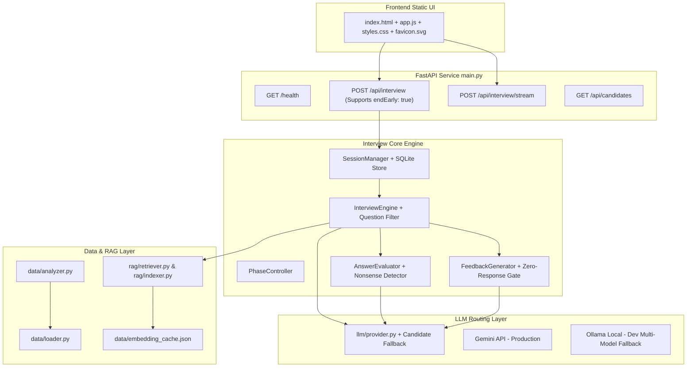

# AI Technical Interview Agent | Cohort Simulator

> **Author Note**: I am Inusha Gunasekara, a solo competitor in Vobecodathon hackathon.

An enterprise-grade, personalized AI Technical Interview Agent built for graduating members of an intensive 31-day AI Engineering Cohort program.

The system evaluates candidates across vector search, RAG, prompt engineering, multi-agent frameworks, fine-tuning, and production deployment using adaptive, multi-turn technical dialogues grounded in candidate-specific learning histories.

---

## 🌟 Highlights & Features

- **Adaptive Candidate Analytics**: Calibrates difficulty (Foundational, Intermediate, Senior) and targets individual struggle areas, skipped topics, and first-try mastery wins.
- **Deterministic Phase Controller & Question Enforcement**: Manages state transitions across `INTRO`, `CORE`, `FOLLOW_UP`, and `WRAP_UP` phases, enforcing a Question Enforcement Filter that appends concrete technical questions (`?`) and guarantees at least **8 primary questions across 4+ distinct curriculum days** before structured conclusion.
- **On-Demand Early Termination (`🛑 End Interview`)**: Allows candidates or evaluators to end an active interview early via the header action bar or `endEarly: true` API parameter, immediately generating a structured performance evaluation across completed turns.
- **Enriched Topic Scores & Visual Evaluation Cards**: Renders glassmorphic cards in the post-interview evaluation report featuring detailed 1-2 sentence technical notes (`DESCRIPTIVE_TOPIC_NOTES`), mastery status pills (`Mastery Demonstrated`, `Proficient`, `Needs Consolidation`, `Not Evaluated`), animated progress fill bars, and core technology chips (`[FastAPI, Pydantic]`, `[ChromaDB, HNSW]`, `[LangGraph, State Machine]`).
- **Zero-Response Evaluation Safeguard**: Detects when an interview is terminated before candidate responses are submitted (0 answers) and outputs an honest `0/10 NOT EVALUATED` evaluation report instead of fabricating passing scores.
- **Active Session Guard**: Locks candidate dropdown selection and disables the `Start Interview` button while an interview session is active, preventing accidental session collision.
- **Resilient Multi-Model Candidate Fallback & Live Telemetry**: Automatically iterates through installed local Ollama models (`gemma3:1b` → `qwen3:4b` → `gemma4:e2b`) on HTTP 500 errors. Streams live execution metrics (`llm_provider`, `llm_model`, `llm_latency_ms`) directly into the browser Debug Drawer (`#debugDrawer`).
- **Curriculum RAG Engine**: Injects real-time curriculum objectives and tool contexts into system prompts using Gemini embeddings (`text-embedding-004` / `embedding-001`) and in-memory cosine similarity (with a pre-built offline cache for local dev).
- **Dual-Layer Nonsense Protection**: Prevents low-effort gibberish or keyboard mashing from disrupting interview flow via client-side heuristic toasts and server-side strike counters.
- **Environment-Aware LLM Routing**:
  - **Local Development**: Runs with **Ollama** (`OLLAMA_MODEL=gemma3:1b` or `qwen2.5`) with no Gemini key required.
  - **Production (Render)**: Connects directly to **Gemini API** (`gemini-2.0-flash`).
  - **Automated Testing**: Offline mock provider (`APP_ENV=test`).
- **Rich Structured Feedback & Export**: Produces executive summary, strengths, knowledge gaps, next steps, curriculum topic scores, and evidence quotes with one-click **Markdown Export** (Copy & Download).
- **SQLite Session Persistence**: Maintains session history across restarts with automated 2-hour idle TTL cleanup.
- **Custom Vector Favicon**: Custom glowing dark slate/cyan SVG icon (`static/favicon.svg`).

---

## 🏗 Architecture Overview



---

## 🛠 Two-Environment Configuration

| Setting | Local Development | Production (Render) | Unit Testing |
|---|---|---|---|
| `APP_ENV` | `development` | `production` | `test` |
| `LLM_PROVIDER` | `ollama` | `gemini` | `mock` |
| `GEMINI_API_KEY` | Optional | Required | Optional |
| RAG Strategy | Cached vectors / keyword search | Gemini API live embeddings | Pre-indexed mock vectors |

---

## 🚀 Quick Start (Local Setup)

### 1. Prerequisites
- Python 3.10+
- (Optional) [Ollama](https://ollama.com/) running locally for development (`ollama pull gemma3:1b`).

### 2. Installation
```bash
git clone https://github.com/inusha-thathsara/Vibecodathin---Personalized-Interview-Preparation-Agent.git
cd Vibecodathin---Personalized-Interview-Preparation-Agent
python -m venv .venv
# On Windows:
.venv\Scripts\activate
# On Linux/macOS:
source .venv/bin/activate

pip install -r requirements.txt
```

### 3. Environment Setup
Create a `.env` file from `.env.example`:
```bash
cp .env.example .env
```
Edit `.env` for your local environment:
```env
APP_ENV=development
LLM_PROVIDER=ollama
OLLAMA_BASE_URL=http://localhost:11434
OLLAMA_MODEL=gemma3:1b
```

### 4. Run Development Server
```bash
python main.py
```
Open your browser at `http://127.0.0.1:8000` to select a candidate and launch the simulator.

---

## 🧪 Running the Test Suite

The test suite covers candidate analysis, engagement scoring, heuristic nonsense detection, zero-response safeguards, early interview termination, phase state transitions, RAG retrieval, feedback schema generation, and FastAPI endpoints:

```bash
python -m pytest tests/ -v
```
*(All **17 test cases** pass cleanly).*

---

## ☁️ Production Deployment (Render)

This repository includes deployment manifests for **Render**:
- `Dockerfile`
- `render.yaml`

### Render Blueprint Deployment:
1. Connect your repository on Render.
2. Render will automatically detect `render.yaml`.
3. Set the following environment variable in the Render Dashboard:
   - `GEMINI_API_KEY`: Your production Gemini API key.
4. Render will run health checks against `/health` and deploy the containerized app.

---

## 🔌 API Contract Summary

- `GET /health`: Health status and active LLM provider diagnostic check.
- `GET /api/candidates`: List all graduating candidates and history profiles.
- `POST /api/interview`: Standard API spec endpoint. Accepts `sessionId`, `candidate`, `message`, and optional `endEarly: true` flag. Returns `reply`, `done`, `feedback`, and telemetry `meta`.
- `POST /api/interview/stream`: Server-Sent Events (SSE) streaming endpoint.

---

## 🧩 Extension Points & Core Logic

- **Persona & System Rules**: [`interview/prompts.py`](file:///e:/Documents/Projects/VibeCodathon/interview/prompts.py)
- **Phase Transition Rules**: [`interview/phases.py`](file:///e:/Documents/Projects/VibeCodathon/interview/phases.py)
- **Feedback & Topic Scores**: [`interview/feedback.py`](file:///e:/Documents/Projects/VibeCodathon/interview/feedback.py)
- **Multi-Model LLM Routing**: [`llm/provider.py`](file:///e:/Documents/Projects/VibeCodathon/llm/provider.py)
- **Data Models & Schemas**: [`models.py`](file:///e:/Documents/Projects/VibeCodathon/models.py)
