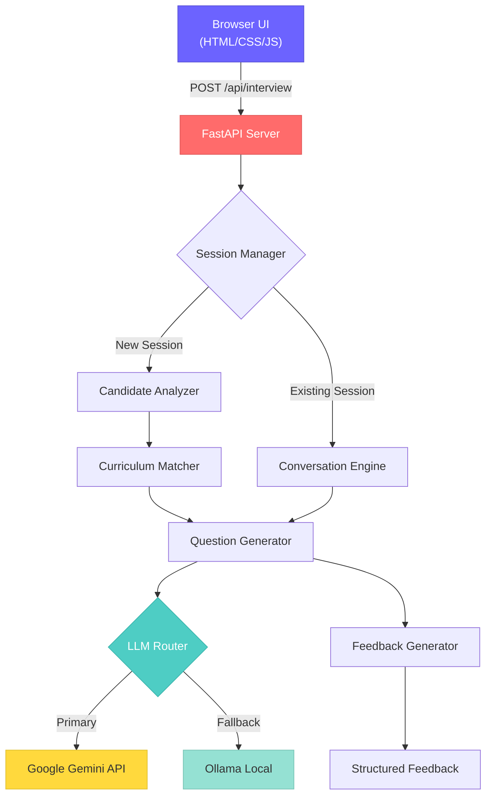
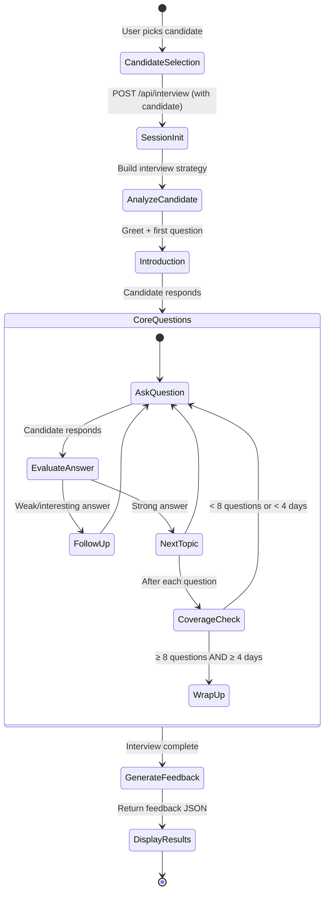

# AI Interview Agent — Implementation Plan

Build a personalized AI Interview Agent that conducts multi-turn technical interviews for candidates of a 31-day AI Cohort program. The agent adapts questions based on each candidate's completed missions, attempts, skipped topics, and learning signals.

---

## User Review Required

> [!IMPORTANT]
> **Dual LLM Provider**: The plan implements both **Google Gemini** (primary, cloud) and **Ollama** (local fallback). The system will try Gemini first and gracefully fall back to Ollama if unavailable. You'll need a **Gemini API key** for cloud mode.

> [!WARNING]
> **Live Demo URL**: The rules require a functional Live Demo URL. We'll build a stunning frontend UI. For deployment, you'll need to host this somewhere (e.g., Render, Railway, or a VPS). The plan covers local dev; deployment can be addressed later.

---

## Open Questions

1. **Gemini Model**: Should we use `gemini-2.0-flash` (fast/free) or `gemini-1.5-pro` (higher quality)? Defaulting to `gemini-2.0-flash` for speed and cost.
2. **Ollama Model**: Which local model do you have installed? Plan assumes `qwen2.5` or `llama3`. We can adapt.
3. **Deployment Target**: Any preference for hosting? (Render, Railway, Vercel, self-hosted?)

---

## Architecture Overview



---

## Proposed Changes

### Component 1: Project Scaffolding & Configuration

Sets up the FastAPI project, dependency management, and dual-LLM configuration.

#### [NEW] [requirements.txt](file:///e:/Documents/Projects/VibeCodathon/requirements.txt)
- `fastapi`, `uvicorn[standard]` — web server
- `google-generativeai` — Gemini SDK
- `openai` — Ollama-compatible client (OpenAI SDK works with Ollama's API)
- `pydantic` — request/response validation
- `python-dotenv` — environment variable management
- `uuid` — session ID handling (stdlib)

#### [NEW] [.env.example](file:///e:/Documents/Projects/VibeCodathon/.env.example)
- `GEMINI_API_KEY` — Google Gemini API key
- `OLLAMA_BASE_URL` — defaults to `http://localhost:11434`
- `OLLAMA_MODEL` — defaults to `qwen2.5`
- `LLM_PROVIDER` — `gemini` | `ollama` | `auto` (try Gemini first, fallback to Ollama)

#### [NEW] [config.py](file:///e:/Documents/Projects/VibeCodathon/config.py)
- Centralized configuration loading from `.env`
- LLM provider selection logic
- Curriculum and candidate data paths

---

### Component 2: Data Layer — Curriculum & Candidate Analysis

Loads and analyzes the provided JSON data to drive personalized interviews.

#### [NEW] [data/loader.py](file:///e:/Documents/Projects/VibeCodathon/data/loader.py)
- Load `curriculum.json` → parsed module/day/objective structure
- Load `candidates.json` → candidate profiles with missions and signals
- Build lookup maps: `day → module`, `day → objectives`, `day → tools`

#### [NEW] [data/analyzer.py](file:///e:/Documents/Projects/VibeCodathon/data/analyzer.py)
- **`analyze_candidate(candidate)`** — produces an interview strategy:
  - **Strength areas**: Missions passed on first attempt (attempts = 1)
  - **Struggle areas**: Missions with ≥ 3 attempts (probe deeper here)
  - **Failed missions**: Topics the candidate attempted but didn't pass
  - **Skipped topics**: Topics the candidate skipped entirely (potential gaps)
  - **Coverage map**: Which modules/days they covered vs. skipped
  - **Experience-adjusted difficulty**: Scale questions based on `yearsExperience` and `jobRole`
- Outputs a structured `InterviewStrategy` Pydantic model

---

### Component 3: LLM Provider Abstraction

Unified interface for both Gemini and Ollama, with automatic fallback.

#### [NEW] [llm/provider.py](file:///e:/Documents/Projects/VibeCodathon/llm/provider.py)
- Abstract `LLMProvider` base class with `generate(messages, system_prompt) → str`
- **`GeminiProvider`**: Uses `google-generativeai` SDK with `gemini-2.0-flash`
- **`OllamaProvider`**: Uses OpenAI-compatible client pointing to Ollama's local API
- **`AutoProvider`**: Tries Gemini → catches errors → falls back to Ollama
- Health check method to verify provider availability at startup

---

### Component 4: Interview Engine (Core Logic)

The heart of the system — manages interview state, generates questions, tracks context.

#### [NEW] [interview/session.py](file:///e:/Documents/Projects/VibeCodathon/interview/session.py)
- `InterviewSession` class holding per-session state:
  - `session_id`, `candidate` profile, `interview_strategy`
  - `conversation_history` — full list of `{role, content}` messages
  - `questions_asked` — count and topic tracking (ensures ≥ 8 questions across ≥ 4 days)
  - `covered_days` — set of curriculum days touched
  - `current_phase` — `INTRO | CORE_QUESTIONS | FOLLOW_UP | WRAP_UP`
  - `is_complete` — boolean flag
- `SessionManager` — dict-based in-memory store keyed by `sessionId`

#### [NEW] [interview/engine.py](file:///e:/Documents/Projects/VibeCodathon/interview/engine.py)
- **`start_interview(session)`** — generates the opening message:
  - Greets candidate by name
  - Briefly mentions their background (role, experience)
  - Asks the first question based on the interview strategy
- **`process_response(session, message)`** — the main loop:
  1. Appends candidate's answer to conversation history
  2. Builds a dynamic system prompt including:
     - Interviewer persona & instructions
     - Candidate's profile and strategy (strengths, struggles, gaps)
     - Curriculum context for relevant days (objectives, tools)
     - Rules: ask follow-ups, probe weak areas deeper, maintain natural tone
     - Coverage tracking: "You have asked N questions on M days. Need ≥ 8 on ≥ 4."
  3. Calls LLM to generate next interviewer turn
  4. Parses whether the LLM signals interview completion
  5. If complete → triggers feedback generation
- **`generate_follow_up(session, candidate_answer)`** — analyzes the answer quality and decides:
  - Good answer → move to next topic or ask a harder follow-up
  - Weak answer → probe deeper on the same topic
  - Off-topic → gently redirect

#### [NEW] [interview/prompts.py](file:///e:/Documents/Projects/VibeCodathon/interview/prompts.py)
- **System prompt template** — the core interviewer persona:
  - "You are a senior AI engineering interviewer..."
  - Injects candidate-specific context (completed topics, struggle areas)
  - Injects curriculum context (day objectives, tools for the topic being discussed)
  - Instructions for natural conversation flow, follow-ups, difficulty adaptation
- **Feedback generation prompt** — summarizes the interview into structured feedback
- **Question planning prompt** — helps the LLM plan which topics to cover next

#### [NEW] [interview/feedback.py](file:///e:/Documents/Projects/VibeCodathon/interview/feedback.py)
- `generate_feedback(session) → FeedbackResponse`
- Sends the full conversation to the LLM with a structured output prompt
- Parses into: `summary` (string), `strengths` (string[]), `gaps` (string[]), `next` (string[])
- Fallback: if LLM output isn't valid JSON, uses regex/heuristic parsing

---

### Component 5: API Server (FastAPI)

Implements the required `POST /api/interview` endpoint per the technical spec.

#### [NEW] [main.py](file:///e:/Documents/Projects/VibeCodathon/main.py)
- FastAPI app with CORS middleware (for frontend)
- Static file serving for the frontend UI
- Startup event: load curriculum + candidates, initialize LLM provider
- **`POST /api/interview`** handler:
  - If request has `candidate` field → **start new interview**:
    1. Create `InterviewSession` with the candidate data
    2. Run candidate analysis → generate interview strategy
    3. Call `start_interview()` → first question
    4. Return `{ reply: "...", done: false }`
  - If request has `message` field → **conversation turn**:
    1. Look up session by `sessionId`
    2. Call `process_response()` → next question or wrap-up
    3. If interview complete → include `feedback` in response
    4. Return `{ reply: "...", done: true/false, feedback?: {...} }`
- **`GET /api/candidates`** — returns the list of candidates (for frontend dropdown)
- **`GET /`** — serves the frontend UI

#### [NEW] [models.py](file:///e:/Documents/Projects/VibeCodathon/models.py)
- Pydantic models matching the technical spec:
  - `InterviewRequest` — `sessionId`, optional `candidate`, optional `message`
  - `FeedbackResponse` — `summary`, `strengths`, `gaps`, `next`
  - `InterviewResponse` — `reply`, `done`, optional `feedback`
  - `CandidateProfile`, `Mission`, `Signals` — matching the candidates.json schema

---

### Component 6: Frontend UI (Premium Chat Interface)

A stunning, polished chat interface that serves as the Live Demo URL.

#### [NEW] [static/index.html](file:///e:/Documents/Projects/VibeCodathon/static/index.html)
- Single-page app structure
- Candidate selection sidebar with profile cards
- Main chat area with message bubbles
- Feedback panel (slides in when interview completes)
- SEO meta tags, proper heading hierarchy

#### [NEW] [static/styles.css](file:///e:/Documents/Projects/VibeCodathon/static/styles.css)
- **Design System**: Dark mode with glassmorphism
- **Color Palette**: Deep navy (`#0a0e27`) base, electric purple (`#6C63FF`) accents, cyan highlights (`#4ECDC4`), warm coral for alerts (`#FF6B6B`)
- **Typography**: Google Fonts — `Inter` for UI, `JetBrains Mono` for code/technical terms
- **Components**:
  - Glassmorphic candidate cards with hover lift animations
  - Chat bubbles with subtle entrance animations (slide-in + fade)
  - Typing indicator with pulsing dots
  - Gradient progress bar showing interview progress
  - Feedback panel with animated strength/gap/next cards
- **Responsive**: Flexbox/Grid layout, works on desktop and tablet
- **Micro-animations**: Smooth transitions on all interactive elements, particle background effect

#### [NEW] [static/app.js](file:///e:/Documents/Projects/VibeCodathon/static/app.js)
- **Candidate Selection**: Fetch candidates from `/api/candidates`, render profile cards, click to start
- **Chat Engine**:
  - `startInterview(candidate)` → POST with candidate object, display welcome message
  - `sendMessage(text)` → POST with message, display typing indicator, render response
  - Auto-scroll chat to bottom on new messages
  - Disable input while waiting for response
- **Feedback Display**: When `done: true`, render the feedback object as a beautiful summary panel
- **Session Management**: Generate UUID for each interview, track state
- **UX Polish**: Enter to send, message timestamps, interview progress tracker

---

### Component 7: AI Usage Log (PROMPTS.md)

The hackathon rules require an **AI Usage Log** that is "included and accessible" — it must correspond to the implemented features and demonstrate genuine development activity.

#### [MODIFY] [PROMPTS.md](file:///e:/Documents/Projects/VibeCodathon/PROMPTS.md)
- **Format**: Structured markdown log with timestamps, tool used, prompt text, and result summary
- **Policy**: Every user command/prompt to the AI assistant is appended here
- **Structure per entry**:
  - `### Prompt N — HH:MM IST` header
  - `**Tool:**` — which AI tool was used (Gemini/Antigravity IDE, ChatGPT, etc.)
  - `**Prompt:**` — the exact user request (blockquoted)
  - `**Result:**` — brief summary of what was accomplished
- **Sessions**: Grouped by date under `## Session N — YYYY-MM-DD`
- **Why**: RULES.md Stage 2 (Authenticity Review) checks that the AI Usage Log reasonably corresponds to implemented features. Incomplete or generic logs may trigger disqualification.

---

## Project Structure

```
VibeCodathon/
├── main.py                    # FastAPI app + API endpoint
├── config.py                  # Configuration & env loading
├── models.py                  # Pydantic request/response models
├── requirements.txt           # Python dependencies
├── .env.example               # Environment variable template
├── .env                       # Actual env vars (gitignored)
├── candidates.json            # Provided data (existing)
├── curriculum.json            # Provided data (existing)
├── Problem_Statement.md       # Provided (existing)
├── RULES.md                   # Provided (existing)
├── technical-spec.md          # Provided (existing)
├── PROMPTS.md                 # AI Usage Log (required for submission)
├── data/
│   ├── __init__.py
│   ├── loader.py              # JSON data loading
│   └── analyzer.py            # Candidate analysis & strategy
├── llm/
│   ├── __init__.py
│   └── provider.py            # Gemini + Ollama providers
├── interview/
│   ├── __init__.py
│   ├── session.py             # Session state management
│   ├── engine.py              # Core interview logic
│   ├── prompts.py             # System prompt templates
│   └── feedback.py            # Structured feedback generation
└── static/
    ├── index.html             # Chat UI
    ├── styles.css             # Premium dark-mode styles
    └── app.js                 # Frontend logic
```

---

## Interview Flow Design



### Intelligent Question Selection Strategy

1. **Struggle-first**: Start with topics where the candidate had ≥ 3 attempts — these reveal genuine understanding vs. brute-force completion
2. **Skip probing**: Ask about skipped topics to assess if they understand the concepts despite not completing the mission
3. **Strength validation**: Verify first-try topics with deeper questions — was it genuine mastery or surface-level?
4. **Cross-topic connections**: Ask questions that connect multiple days (e.g., "How would embeddings from Day 7 feed into the RAG pipeline from Day 11?")
5. **Experience calibration**: Adjust depth based on `yearsExperience` — ask a junior about concepts, ask a senior about architecture decisions

---

## Verification Plan

### Automated Tests
```bash
# 1. Install dependencies
pip install -r requirements.txt

# 2. Start the server
uvicorn main:app --reload --port 8000

# 3. Test: Start an interview (using a candidate from the JSON)
curl -X POST http://localhost:8000/api/interview \
  -H "Content-Type: application/json" \
  -d '{"sessionId": "test-001", "candidate": {"member": {"id": "CAND-003", "name": "Emily Chen", "jobRole": "AI Engineer", "yearsExperience": 6, "education": "MS Artificial Intelligence", "status": "COMPLETED"}, "missions": [{"day": 7, "title": "Embeddings Explained", "passed": true, "attempts": 1}], "signals": {"commitDays": 31, "missionsCompleted": 31, "missionsFirstTry": 30}}}'

# 4. Test: Send a conversation turn
curl -X POST http://localhost:8000/api/interview \
  -H "Content-Type: application/json" \
  -d '{"sessionId": "test-001", "message": "Embeddings convert text into dense vector representations that capture semantic meaning."}'

# 5. Test: Verify candidates endpoint
curl http://localhost:8000/api/candidates
```

### Manual Verification
- Open `http://localhost:8000` in browser → verify the chat UI loads
- Select a candidate → verify interview starts with a personalized greeting
- Respond to 8+ questions → verify follow-ups are contextual and adaptive
- Complete the interview → verify structured feedback appears
- Test with different candidate profiles (high performer vs. struggling) → verify difficulty adapts
- Test Gemini → Ollama fallback by removing the API key
